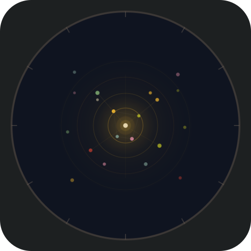
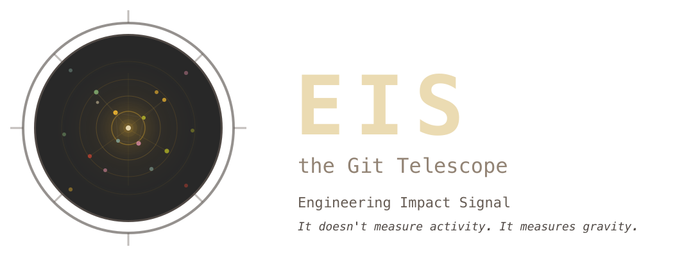
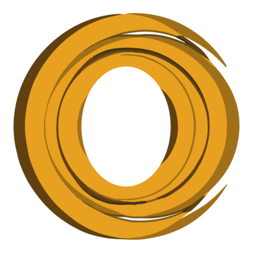
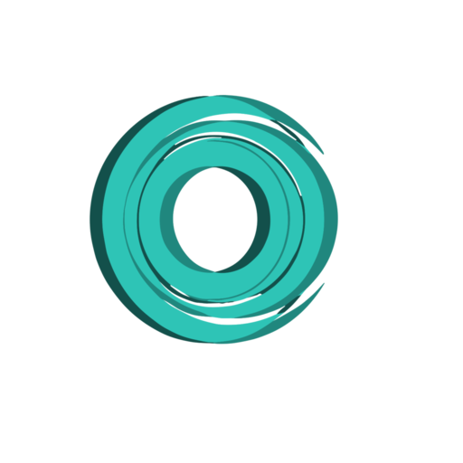
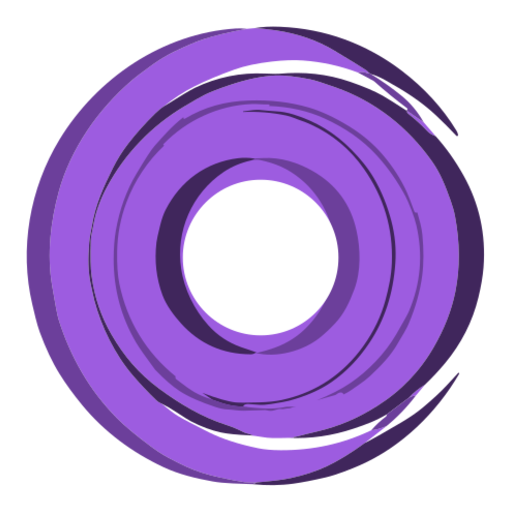

# Canonical brand & logo assets

This file is the source of truth for which logo marks are current, kept in sync
with the orbit repo's `README.md` → **Logos** and the color study
`pages/logo-blur-color-study.html`. Use only the assets listed below; do not
introduce a new variant.

**OSS EIS and SaaS OrbitLens have separate marks. Keep them separate.**
EIS (the open-source Git telescope) uses the dark **radar / aperture** mark.
OrbitLens uses the **orbital-ring lens** marks — Obsidian Scholar for the company
and a **2-Color Phase Blur on Charcoal (Type B)** for each product. Do not swap
one identity for the other.

## EIS marks (this repo)

| Preview | Asset | What it is | Notes |
|:---:|---|---|---|
|  | `logo-icon.svg` / `logo-icon.png` / `logo-icon-transparent.*` | **EIS mark** — the dark radar/telescope aperture (a dark circle with tick marks and a starfield/orbit interior). This is the **retired Ace radar-constellation logo, repurposed as the EIS mark** (OrbitLens dropped the radar frame; EIS, the telescope, inherits it). | The OSS EIS icon. Distinct from the OrbitLens lens marks on purpose. |
|  | `logo-full.svg` / `logo-full.png` | **EIS lockup** — the radar mark + the wordmark "EIS — the Git Telescope — Engineering Impact Signal". | Used as the sign-off footer in the blog articles. **Referenced by published blog posts via absolute `raw.githubusercontent.com/machuz/eis/main/docs/images/logo-full.png` URLs — do NOT move or rename this path**, or the live posts will 404. Re-render the PNG in place via `rsvg-convert` if the SVG changes. |

## OrbitLens marks (canonical in the orbit repo; previews mirrored here)

The full taxonomy lives in the orbit repo's `README.md` → Logos. All OrbitLens
marks are the orbital-ring **lens** motif (the radar frame is retired). Previews
are copied into `docs/images/marks/`. The 3 product marks are **2-Color Phase
Blur (Type B)** with a **transparent centre** (they read on light *and* dark);
they are made by recoloring `docs/images/company_logo_base.svg` **without
touching the shape** — see the orbit repo's `docs/images/PRODUCT-LOGOS.md`.

| Preview | Role | Colorway | Source (orbit repo) |
|:---:|---|---|---|
|  | OrbitLens company mark | **Obsidian Scholar** — navy `#0B1020` / gold `#D8A24A` / slate `#40556F` | `site/logo-orbitlens-mark.svg` |
|  | Ace product mark | **Amber** (`#e8a020`) — Type B / transparent centre | `lp/logo-ace.svg` → copied here as `logo-ace-mark.svg` |
|  | True product mark | **Teal** (`#2ec4b6`) — Type B / transparent centre | `lp/logo-true.svg` |
|  | Ideal product mark | **Royal Purple** (`#9d5ce0`) — Type B / transparent centre | `lp/logo-ideal.svg` |

- `logo-ace-mark.svg` — the **Ace** product mark (Amber, a copy of the canonical `lp/logo-ace.svg` in the orbit repo). Used on Ace blog covers.
- `orbitlens-royal-purple-shadow.png` — the legacy OrbitLens brand icon still used as this library's favicon and nav/breadcrumb lockups. The **canonical company mark is now Obsidian Scholar** (`marks/company.png`); refresh this asset when convenient.

## Wordmark

The metric is **Engineering Impact Signal** — "Signal", not "Score". A wordmark
that says "Score" is outdated; use "Signal".

## Don't

- Don't put an OrbitLens orbital-ring **lens** mark where **EIS** is meant — EIS
  is the radar/aperture mark. They are deliberately different identities.
- Don't introduce a new logo variant; reuse one of the assets above.
