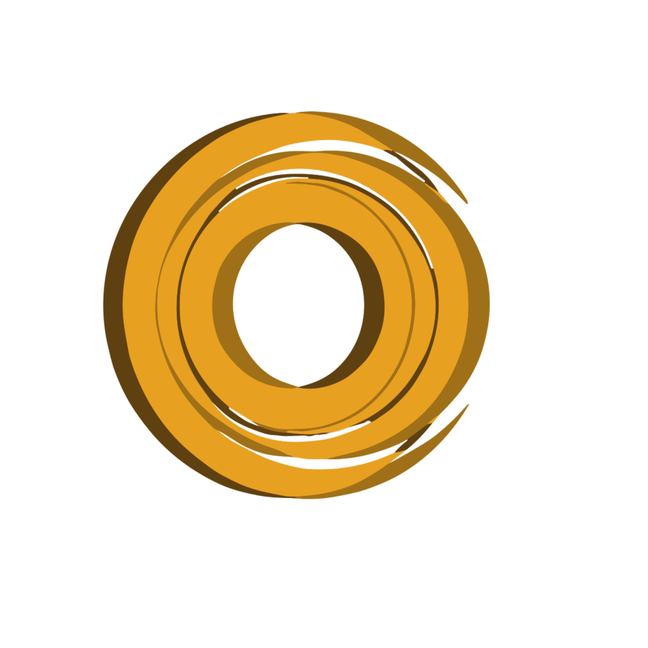
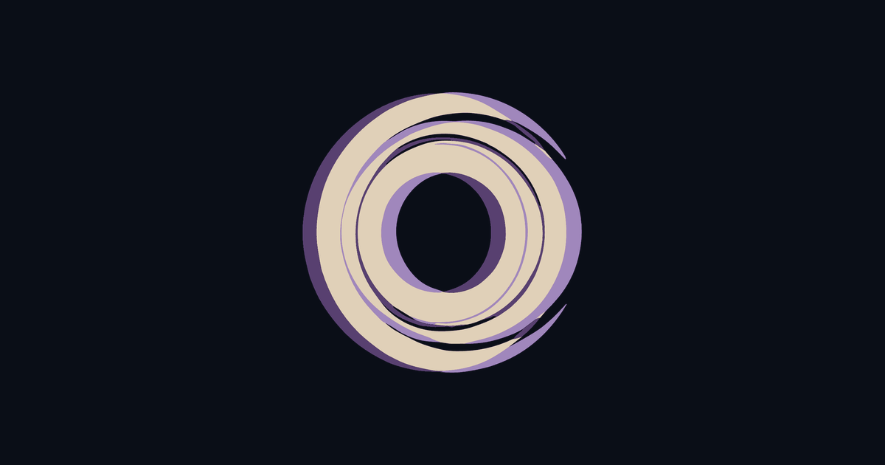

# Canonical brand & logo assets

This file is the source of truth for which logo marks are current. Use only the
assets listed below. If you need a logo somewhere, point at one of these — do not
introduce a new variant.

**OSS EIS and SaaS OrbitLens Ace have separate marks. Keep them separate.**
EIS (the open-source Git telescope) uses the dark **radar/aperture** mark. The
gold **orbit-ring** mark belongs to OrbitLens Ace (the product) — do not use it
to stand in for EIS.

## Current assets

| Preview | Asset | What it is | Notes |
|:---:|---|---|---|
|  | `logo-icon.svg` / `logo-icon.png` / `logo-icon-transparent.*` | **EIS mark** — the dark radar/telescope aperture (a dark circle with tick marks and a starfield/orbit interior). This is the **retired Ace radar-constellation logo, repurposed as the EIS mark** (OrbitLens dropped the radar frame; EIS, the telescope, inherits it). | The OSS EIS icon. Distinct from the current Ace lens mark on purpose. |
|  | `logo-full.svg` / `logo-full.png` | **EIS lockup** — the radar mark + the wordmark "EIS — the Git Telescope — Engineering Impact Signal". | Used as the sign-off footer in the blog articles. **Referenced by published blog posts via absolute `raw.githubusercontent.com/machuz/eis/main/docs/images/logo-full.png` URLs — do NOT move or rename this path**, or the live posts will 404. Re-render the PNG in place via `rsvg-convert` if the SVG changes. |
|  | `logo-ace-mark.svg` | **OrbitLens Ace product mark** — the gold orbit-ring (a hollow-centre lens, brushstroke concentric rings). | The product mark for Ace only. Copy of the canonical `lp/logo-ace.svg` in the orbit repo. Used on Ace blog covers. |
|  | `orbitlens-royal-purple-shadow.png` | **OrbitLens brand icon** — the purple orbit-ring. | The company/OrbitLens icon; used as favicon and in nav/breadcrumb lockups across the library and on the OrbitLens Ace landing. |

## Wordmark

The metric is **Engineering Impact Signal** — "Signal", not "Score". A wordmark
that says "Score" is outdated; use "Signal".

## Don't

- Don't put the gold **orbit-ring** (Ace) mark where **EIS** is meant — EIS is the
  radar/aperture mark. They are deliberately different identities.
- Don't introduce a new logo variant; reuse one of the assets above.
