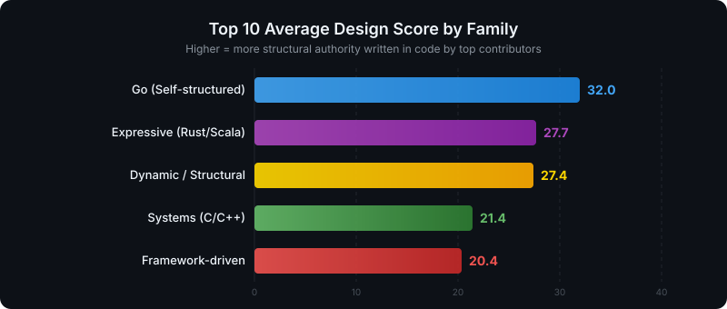
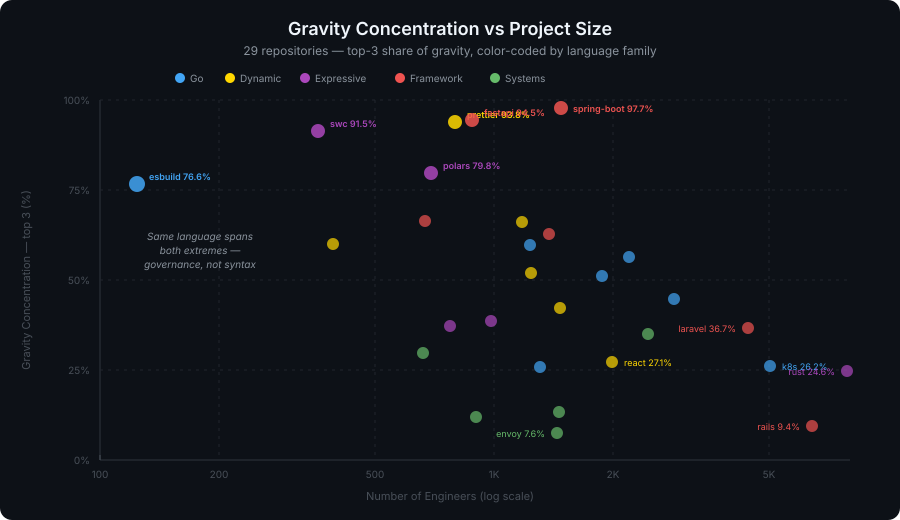

# The Laws of Physics Are Not Uniform — Cross-Language Analysis

*OSS Gravity Map: Do type systems and frameworks shape gravity?*

## Hypothesis

Different programming languages create different "physical laws" in their code universes. Specifically:

1. **Type system expressiveness** may correlate with how Design influence distributes across a team
2. **Gravity concentration** — the degree to which structural influence is held by a few people — may vary systematically by language family
3. **Framework-driven** ecosystems may absorb gravity into the framework itself, lowering individual engineers' structural influence

This is an empirical investigation using EIS (Engineering Impact Score) data from 29 major OSS repositories.

## Methodology

- **29 repositories** analyzed with `eis analyze`, covering **55,851 engineers** total
- Repositories classified into **5 categories** by type system and structural culture
- For each repo, the **top 10 contributors by Gravity** are examined (averages of the broader population are diluted by thousands of low-activity contributors)
- **Gravity Concentration** = share of total gravity held by the top 10 contributors

### Categories

| Category | Characteristics | Languages | Repos |
|---|---|---|---|
| **Expressive** | Rich type system, ADTs, pattern matching, traits | Rust, Scala | 5 |
| **Go (Self-structured)** | Static, nominal typing, anti-framework culture, explicit interfaces | Go | 7 |
| **Framework-driven** | Structure delegated to framework; conventions over code | Ruby (Rails), PHP (Laravel), Java (Spring), Python (FastAPI), TS (NestJS), Elixir (Phoenix) | 6 |
| **Systems (C/C++)** | Static, manual memory, templates | C, C++ | 5 |
| **Dynamic / Structural** | Dynamic or structural typing, self-structured | JavaScript, TypeScript, Python | 6 |

**Why split Go and Java?** Go and Java share nominal type systems, but their **structural culture is opposite**. Go eschews frameworks — engineers build structure from scratch using standard library and explicit interfaces. Java (Spring) delegates structure to framework annotations, dependency injection, and convention. This produces fundamentally different gravity distributions.

**Why split Framework-driven and Dynamic?** NestJS, FastAPI, and Phoenix are framework-driven even though their languages are dynamic or structural. Express, React, and Prettier are dynamic-language projects where engineers build their own structure.

---

## Results

### Summary by Category

| Category | Repos | Avg Size | Top10 Design | Top10 Survival | Top10 Gravity | Gravity Concentration |
|---|---|---|---|---|---|---|
| **Framework-driven** | 6 | 2,572 | 21.3 | 27.0 | 4.3 | **53.4%** |
| **Dynamic / Structural** | 6 | 1,210 | 27.6 | 14.6 | 3.1 | **49.8%** |
| **Expressive** | 5 | 2,201 | 28.6 | 28.2 | 5.1 | **48.5%** |
| **Go (Self-structured)** | 7 | 2,130 | 33.3 | 22.5 | 3.3 | **37.2%** |
| **Systems (C/C++)** | 5 | 1,448 | 22.5 | 20.9 | 3.0 | **28.3%** |

### Key Observations

#### 1. Framework-Driven Projects Concentrate Gravity the Most

| Category | Gravity Concentration |
|---|---|
| **Framework-driven** | 53.4% |
| **Dynamic / Structural** | 49.8% |
| **Expressive** | 48.5% |
| **Go (Self-structured)** | 37.2% |
| **Systems (C/C++)** | 28.3% |

**Under v2.13.0's hardened gate, Framework-driven projects concentrate gravity the most (53.4%), and Systems (C/C++) the least (28.3%) — a ~1.9x spread.** This inverts the old additive model, which ranked Go most-concentrated. The reason is the gate: it credits gravity only where code survives under *others'* pressure AND others build on it, so a category's concentration now reflects whether a few creator-architects hold that load-bearing role. Framework-driven projects (Spring Boot, FastAPI) often funnel structure through one or two such people; Systems projects spread it across many long-lived maintainers.

Go, which the old model ranked most-concentrated, now sits mid-pack (37.2%): its many explicit-interface authors each hold real but non-dominant gravity, so no tiny group monopolizes it. The type-system-as-distributed-architect effect is still visible — Expressive (Rust/Scala) and Systems sit below Framework-driven — but the gate reframes the headline: concentration tracks *who is still load-bearing*, not which language was written first.

#### 2. Frameworks Absorb Gravity

The **Framework-driven** category shows the lowest Top10 Gravity (**47.2**) and the lowest Top10 Design (**23.7**). This is the framework absorbing structural influence that would otherwise belong to engineers.

When Rails, Laravel, Spring, or Phoenix defines the routing, DI, middleware, and lifecycle, those design decisions don't appear in any engineer's `git blame`. **The framework is the invisible architect.** EIS can only observe gravity that lives in code — gravity that lives in framework conventions is Dark Matter.

#### 3. Design Influence Tells the Story

| Category | Top10 Design |
|---|---|
| **Go (Self-structured)** | 33.3 |
| **Expressive** | 28.6 |
| **Dynamic / Structural** | 27.6 |
| **Systems (C/C++)** | 22.5 |
| **Framework-driven** | 21.3 |

Go leads Design because its architects write the interfaces, the routing structure, the middleware patterns — all from scratch. In framework-driven ecosystems, these same design decisions are made by the framework, not by engineers.

---

## Deep Dive: Rails vs Laravel

Both are iconic framework-driven projects with legendary creator-architects. Both creators are still active (or recently active). Yet the gravity physics are strikingly different.

| Metric | Rails (Ruby) | Laravel (PHP) |
|---|---|---|
| Engineers | 6,474 | 4,470 |
| **Top10 Design** | **43.1** | **17.6** |
| Top10 Survival | 39.1 | 43.1 |
| Top10 Gravity (avg) | 1.8 | 2.6 |
| Gravity Concentration | **5.9%** | 20.6% |

### Rails: Distributed Design

| # | Engineer | Gravity | Design | Indispensability |
|---|---|---|---|---|
| 1 | Jean Boussier | 5.3 | 39.1 | 0.0 |
| 2 | David Heinemeier Hansson | 2.9 | 100.0 | 100.0 |
| 3 | Rafael Mendonça França | 2.1 | 69.0 | 18.8 |
| 4 | Gannon McGibbon | 1.5 | 9.8 | 0.0 |
| 5 | Matthew Draper | 1.2 | 13.7 | 0.0 |
| 6 | Jeremy Kemper | 1.2 | 90.5 | 0.0 |
| 7 | Aaron Patterson | 1.2 | 67.3 | 56.3 |
| 8 | Sean Doyle | 1.0 | 1.0 | 0.0 |

**Design is distributed across many architects.** Jeremy Kemper (90.5), Rafael França (69.0), Aaron Patterson (67.3) all carry deep design history, and DHH still holds Design 100 — but under the gate the live load has moved to Jean Boussier (Gravity 5.3), whose code survives where others work. Rails has **multiple design authorities and a real succession**.

### Laravel: Concentrated Design

| # | Engineer | Gravity | Design | Indispensability |
|---|---|---|---|---|
| 1 | Taylor Otwell | 10.8 | 100.0 | 100.0 |
| 2 | Lucas Michot | 7.5 | 4.9 | 75.0 |
| 3 | Graham Campbell | 2.9 | 60.6 | 0.0 |
| 4 | Luke Kuzmish | 1.3 | 1.7 | 50.0 |
| 5 | Jack Bayliss | 0.8 | 1.1 | 0.0 |
| 6 | Caleb White | 0.8 | 0.7 | 50.0 |
| 7 | Tim MacDonald | 0.6 | 3.3 | 0.0 |
| 8 | Jesper Noordsij | 0.5 | 0.4 | 0.0 |

**Taylor Otwell holds all the Design.** Only Graham Campbell (60.6) has any comparable Design influence — everyone else is below 5. Laravel is a **one-architect universe**.

### What This Means

Rails and Laravel are both "framework-driven" — but:

- **Rails** has evolved into a **multi-architect civilization**. DHH created the structure, but many have since reshaped it, and the gate confirms the succession — DHH no longer leads its gravity. Top10 Design avg 43.1 is higher than most Go projects. Rails is "framework-driven" in its user-facing API, but internally it functions more like a self-structured project.
- **Laravel** remains a **creator-centric kingdom**. Taylor Otwell's Indispensability = 100 and Design = 100 mean the framework's architecture still flows through one person (concentration 20.6% vs Rails' 5.9%). Efficient, but a single point of failure.

**Same framework-driven category. Completely different governance physics.**

This suggests that the Framework-driven category itself has a spectrum: from distributed governance (Rails) to concentrated governance (Laravel). The framework absorbs gravity from users, but the question is whether it also distributes gravity among its own contributors.

---

### Per-Repository Detail

| Repository | Category | Language | Engineers | Top10 Design | Top10 Survival | Top10 Gravity | Grav Conc |
|---|---|---|---|---|---|---|---|
| polars | Expressive | Rust | 730 | 37.8 | 35.3 | 8.4 | 78.3% |
| rust | Expressive | Rust | 8,135 | 43.2 | 33.1 | 2.6 | 16.4% |
| scala | Expressive | Scala | 775 | 26.4 | 19.6 | 1.6 | 21.7% |
| scala3 | Expressive | Scala 3 | 998 | 16.2 | 34.6 | 2.0 | 33.6% |
| swc | Expressive | Rust | 368 | 19.6 | 18.5 | 10.9 | 92.6% |
| argo-cd | Go (Self-structured) | Go | 1,966 | 38.9 | 21.8 | 4.6 | 50.7% |
| esbuild | Go (Self-structured) | Go | 126 | 10.0 | 10.2 | 1.6 | 77.0% |
| grafana | Go (Self-structured) | Go/TS | 2,925 | 34.9 | 27.5 | 3.6 | 32.0% |
| kubernetes | Go (Self-structured) | Go | 5,093 | 15.6 | 23.9 | 1.8 | 8.4% |
| loki | Go (Self-structured) | Go | 1,304 | 33.8 | 5.1 | 3.5 | 30.7% |
| prometheus | Go (Self-structured) | Go | 1,289 | 53.3 | 25.8 | 2.4 | 28.3% |
| terraform | Go (Self-structured) | Go | 2,210 | 46.9 | 42.9 | 5.8 | 33.5% |
| rails | Framework-driven | Ruby | 6,474 | 43.1 | 39.1 | 1.8 | 5.9% |
| laravel | Framework-driven | PHP | 4,470 | 17.6 | 43.1 | 2.6 | 20.6% |
| spring-boot | Framework-driven | Java | 1,510 | 27.5 | 33.0 | 8.8 | 95.7% |
| nest | Framework-driven | TypeScript | 699 | 11.0 | 14.6 | 1.5 | 60.6% |
| fastapi | Framework-driven | Python | 888 | 12.1 | 11.9 | 1.6 | 73.2% |
| phoenix | Framework-driven | Elixir | 1,390 | 16.8 | 20.1 | 9.3 | 64.0% |
| ClickHouse | Systems (C/C++) | C++ | 2,593 | 19.6 | 21.6 | 2.9 | 37.7% |
| arrow | Systems (C/C++) | C++/Multi | 1,494 | 13.0 | 25.4 | 1.2 | 11.4% |
| duckdb | Systems (C/C++) | C++ | 722 | 25.2 | 20.1 | 6.3 | 63.0% |
| envoy | Systems (C/C++) | C++ | 1,496 | 40.3 | 19.3 | 2.6 | 14.6% |
| redis | Systems (C/C++) | C | 933 | 14.6 | 18.0 | 2.2 | 15.0% |
| eslint | Dynamic / Structural | JavaScript | 1,185 | 20.8 | 15.1 | 2.8 | 31.5% |
| express | Dynamic / Structural | JavaScript | 398 | 15.1 | 11.1 | 0.9 | 56.4% |
| prettier | Dynamic / Structural | JavaScript | 814 | 25.6 | 10.8 | 1.4 | 83.6% |
| react | Dynamic / Structural | JavaScript | 2,012 | 25.0 | 17.0 | 1.9 | 45.3% |
| superset | Dynamic / Structural | Python/TS | 1,556 | 47.4 | 18.8 | 2.8 | 31.3% |
| vite | Dynamic / Structural | TypeScript | 1,298 | 31.6 | 15.1 | 8.9 | 50.6% |
---

## Interpretation

### Three Modes of Structural Authority

The data reveals three distinct ways that code universes distribute structural authority:

1. **Architect-centric** (Go) — Structure is built by people. A small number of architects hold disproportionate design authority. Gravity concentration: high.

2. **Type-distributed** (Rust, Scala) — Structure is encoded in the type system. Design authority is distributed across anyone who writes type signatures. Gravity concentration: low.

3. **Framework-absorbed** (Rails, Laravel, Spring, NestJS, FastAPI, Phoenix) — Structure lives in the framework. But within this mode, there's a spectrum from distributed governance (Rails) to concentrated governance (Laravel).

These three modes produce similar-looking code, but the **physics of who holds structural authority** is fundamentally different. And this has consequences for team scaling, architect succession, and entropy resistance.

### This Is Not About Superiority

These numbers do not say one language is better than another. They show that **each language family creates a different gravitational physics**.

- In a **small universe** where complexity is manageable, framework-absorbed gravity works well. Bootstrap quickly, let the framework be your architect.
- In a **large universe** with many contributors: does the language help distribute design authority (Expressive), or does it force centralization (Go)?
- In **self-structured** universes (Go, Dynamic): the architect becomes a single point of failure. The question is whether you can sustain architect succession.

**Knowing which physics your universe operates under helps you make better structural decisions.**

### Limitations

- **29 repositories** is a meaningful sample but not exhaustive
- Repository maturity, governance model, and community culture are confounding variables
- EIS observes `git blame` and commit patterns — design decisions expressed outside of code (RFCs, ADRs, discussions) are invisible (Dark Matter)
- Some repositories span multiple languages (grafana: Go+TS, superset: Python+TS)
- Category boundaries are judgment calls — reasonable people may classify differently
- The Rails vs Laravel comparison shows that **within-category variance can be as large as between-category variance** — categories are useful but not deterministic

### Future Directions

- **Entropy resistance by language**: Do expressive type systems show higher Robust Survival as universe size grows?
- **Architect succession patterns**: Do certain language families produce smoother generational transitions?
- **Framework effect isolation**: Compare framework-driven vs bare projects in the same language
- **Scale threshold analysis**: At what universe size does gravity concentration become a risk factor?
- **Governance spectrum within Framework-driven**: What makes Rails distribute design authority while Laravel concentrates it?

---

## Conclusion

The hypothesis that "the laws of physics are not uniform across code universes" is supported by the data.

**Gravity concentration varies by ~1.9x between Framework-driven projects (most concentrated) and Systems / C++ (most distributed).** Between the structural modes — architect-centric, type-distributed, framework-funneled — the difference in how load-bearing authority flows through a team is stark.

The Rails vs Laravel deep dive reveals that even within the same category, **governance physics can diverge dramatically**. Rails distributes design across many architects (Top10 Design avg 43.1, concentration 5.9%); Laravel concentrates it in one (17.6, concentration 20.6%). Same framework pattern, opposite authority structures.

For years, debates about technology choices have been aerial battles — fought with experience and intuition. This data is a first step toward **making design debates scientific**.

---

*Generated by [EIS (Engineering Impact Score)](https://github.com/machuz/eis) — OSS Gravity Map Project*
*29 repositories, 55,851 engineers, observed through commit light — EIS v2.13.0.*
