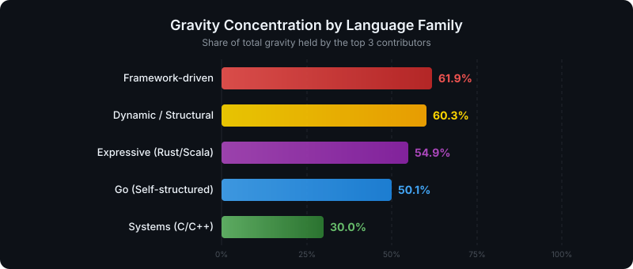
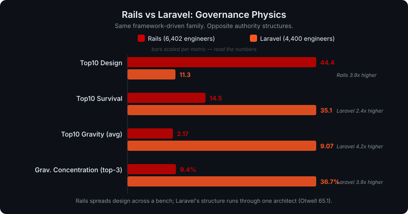
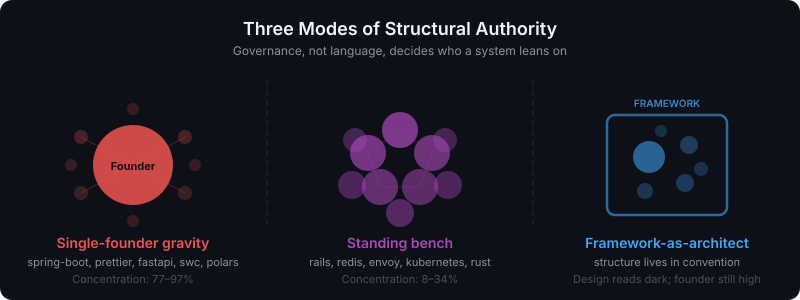

# Deep Dive: Three Governance Models — Rails, Laravel, esbuild

*Same metric. Three completely different governance physics.*

---

## Overview

These three projects represent three extremes of how structural authority distributes in open-source software:

| Project | Category | Engineers | Gravity Conc. | Top10 Design | Governance |
|---|---|---|---|---|---|
| **Rails** | Framework-driven (Ruby) | 6,474 | **5.9%** | **43.1** | Multi-architect civilization |
| **Laravel** | Framework-driven (PHP) | 4,470 | 20.6% | 17.6 | Creator's kingdom |
| **esbuild** | Go (Self-structured) | 126 | **77.0%** | 10.0 | One-person universe |

Gravity Concentration ranges from **5.9% (Rails) to 77.0% (esbuild)** — a ~13x difference (and swc, at 92.6%, is higher still). The same scoring system, the same formula, reveals fundamentally different civilizations.

---

## 1. Rails — The Multi-Architect Civilization



### Key Numbers

| Metric | Value |
|---|---|
| Engineers | 6,474 |
| Gravity Concentration | **5.9%** (lowest of all 29 repos) |
| Top10 Design | **43.1** (higher than most Go projects) |
| Top10 Gravity (avg) | 1.8 |
| Top10 Survival (avg) | 39.1 |
| Architects with Design > 40 | **4 people** |

### Top 10 Gravity Ranking

| # | Engineer | Gravity | Design | Indispensability | Survival | State |
|---|---|---|---|---|---|---|
| 1 | Jean Boussier | 5.3 | 39.1 | 0.0 | 81.0 | Growing |
| 2 | David Heinemeier Hansson | 2.9 | 100.0 | 100.0 | 6.9 | Silent |
| 3 | Rafael Mendonça França | 2.1 | 69.0 | 18.8 | 100.0 | Fragile |
| 4 | Gannon McGibbon | 1.5 | 9.8 | 0.0 | 30.9 | Active |
| 5 | Matthew Draper | 1.2 | 13.7 | 0.0 | 73.2 | Fragile |
| 6 | Jeremy Kemper | 1.2 | 90.5 | 0.0 | 0.0 | Silent |
| 7 | Aaron Patterson | 1.2 | 67.3 | 56.3 | 1.5 | Silent |
| 8 | Sean Doyle | 1.0 | 1.0 | 0.0 | 50.9 | — |
| 9 | Xavier Noria | 1.0 | 39.6 | 0.0 | 9.9 | Silent |
| 10 | zzak | 0.9 | 0.6 | 37.5 | 37.1 | — |

### Design Authority Distribution

```
DHH             ████████████████████████████████████████████████████████  100.0
Jeremy Kemper   █████████████████████████████████████████████████         89.0
Rafael Franca   ██████████████████████████████████████                    68.4
Aaron Patterson ██████████████████████████████                            54.0
Xavier Noria    █████████████████████████                                 45.8
Jose Valim      ██████████████████████                                    39.4
Joshua Peek     ████████████████████                                      36.6
R. Kamizono     ██████████████████                                        33.6
Pratik Naik     █████████████████                                         31.1
                ─────────────────────────── Design > 35 threshold ────────
```

**6 people exceed Design 35.** This is extraordinary for a framework-driven project.

### Analysis

Rails has evolved from a creator-centric kingdom into a **multi-architect civilization**.

DHH created the gravitational center and still holds Design 100, Indispensability 100. But under the hardened gate his decades-old code no longer carries the live load: **DHH sits at Gravity 2.9, while Jean Boussier leads at 5.3** as the author whose code survives where others actively work. Jeremy Kemper (Design 90.5), Rafael França (69.0), and Aaron Patterson (67.3) still carry deep design history.

Top10 Design averaging **43.1** is higher than most Go projects, which are supposed to concentrate design authority. Rails is "framework-driven" in its user-facing API, but internally it functions more like a self-structured project with distributed governance.

The Gravity Concentration of **5.9%** is the lowest of all 29 repos — below Kubernetes (8.4%) and the Rust compiler (16.4%). No single person's departure, not even the creator's, would collapse the structure.

**Rails has achieved architect succession at scale.** This is the gold standard for open-source governance.

---

## 2. Laravel — The Creator's Kingdom



### Key Numbers

| Metric | Value |
|---|---|
| Engineers | 4,470 |
| Gravity Concentration | 20.6% |
| Top10 Design | **17.6** (lower than Rails 43.1) |
| Top10 Gravity (avg) | 2.6 |
| Top10 Survival (avg) | 43.1 |
| Design Authority | **Taylor Otwell alone** |

### Top 10 Gravity Ranking

| # | Engineer | Gravity | Design | Indispensability | Survival | Commits |
|---|---|---|---|---|---|---|
| 1 | Taylor Otwell | 10.8 | 100.0 | 100.0 | 52.0 | 9,844 |
| 2 | Lucas Michot | 7.5 | 4.9 | 75.0 | 66.3 | 743 |
| 3 | Graham Campbell | 2.9 | 60.6 | 0.0 | 28.5 | 1,246 |
| 4 | Luke Kuzmish | 1.3 | 1.7 | 50.0 | 42.9 | 176 |
| 5 | Jack Bayliss | 0.8 | 1.1 | 0.0 | 77.5 | 163 |
| 6 | Caleb White | 0.8 | 0.7 | 50.0 | 10.0 | 60 |
| 7 | Tim MacDonald | 0.6 | 3.3 | 0.0 | 100.0 | 211 |
| 8 | Jesper Noordsij | 0.5 | 0.4 | 0.0 | 13.5 | 75 |
| 9 | Mior Muhammad Zaki | 0.4 | 2.8 | 0.0 | 40.7 | 427 |
| 10 | Michaël De Boey | 0.4 | 0.0 | 0.0 | 0.0 | 7 |

### Design Monopoly

```
Taylor Otwell      ████████████████████████████████████████████████████████  100.0
Graham Campbell    ███████████████████████████████████                        63.1
                   ─────────────────────── gap ──────────────────────────────
Lucas Michot       ██                                                          3.5
Tim MacDonald      █                                                           2.6
Luke Kuzmish       █                                                           1.3
Caleb White        █                                                           1.0
Kay W.             ▏                                                           0.1
Nuno Maduro        ▏                                                           0.2
Others             ▏                                                           0.0
```

**Taylor Otwell holds all the Design.** Only Graham Campbell (60.6) has any comparable architectural reach. Everyone else: Design < 5.

### Analysis

Laravel is a **creator-centric kingdom** — efficient, but with a single point of structural authority.

Taylor Otwell holds Design 100 and Indispensability 100 — the only author with either — for a leading Gravity of 10.8 across 9,844 commits. Even his gravity stays modest because the strict gate demands code surviving under *others'* pressure, and in a one-architect kingdom there is little of that. The structural decisions all flow through one person.

This isn't necessarily a problem. A single architect's consistent vision means less churn — **efficiency through centralization**.

But it creates a bus factor of 1 for structural authority. Compare to Rails: same framework-driven category, but Rails distributes Design across its top contributors (Top10 Design avg **43.1**, 4 authors above 40) vs Laravel's **17.6** (only 2).

**Same framework pattern. Opposite governance physics.**

The interesting question is not "which is better" but "what produced this difference?" Rails is 20+ years old with intentional architect succession. Laravel is younger with a creator who is still the primary architect. Time may tell whether Laravel follows the Rails path toward distributed governance, or maintains its centralized model.

---

## 3. esbuild — The One-Person Universe

### Key Numbers

| Metric | Value |
|---|---|
| Engineers | 126 |
| Gravity Concentration | **77.0%** (swc 92.6% is higher) |
| Top10 Design | 10.0 |
| Evan Wallace | Design/Indisp/Survival **100**, Gravity **15.0** |
| #2 contributor — all axes | Design 0, Indispensability 0, Survival 0 |

### The Singularity

```
Evan Wallace:    Gravity 15.0 | Design 100 | Indispensability 100 | Survival 100
                 ════════════════════════════════════════════════════════════════

Everyone else:   Gravity ~0.2 | Design 0 | Indispensability 0 | Survival 0
                 (no other contributor has any Design or Indispensability)
```

Every contributor other than Evan Wallace scores **zero Design, zero Indispensability, zero Survival** — their gravity rounds to ~0.2. None of their code became structural.

### Where esbuild's 77% Sits

| Project | Gravity Concentration |
|---|---|
| swc | 92.6% |
| **esbuild** | **77.0%** |
| express | 56.4% |
| vite | 50.6% |
| react | 45.3% |
| rust | 16.4% |
| kubernetes | 8.4% |
| rails | 5.9% |

esbuild's concentration is **~9x higher than Kubernetes** and **~13x higher than Rails**. It is not the single most concentrated project (swc edges it out), but it is the purest one-person universe.

### Analysis

esbuild proves that a single brilliant architect can build an entire universe alone.

Evan Wallace created esbuild as a demonstration that JavaScript bundling could be 10-100x faster. He wrote 4,243 commits with Design, Indispensability and Survival all at 100 — for a Gravity of 15.0 (the strict gate holds the absolute down because, in a one-person project, no one else builds on or pressures the code). The result is a focused, fast, correct tool — precisely because one person controls every structural decision.

This is the **extreme end of the architect-centric model** — a gravitational singularity. In physics, singularities are points where normal laws break down. The same is true here: esbuild's governance model doesn't scale, doesn't succession-plan, and doesn't need to. It's a finished artifact, not an evolving ecosystem.

The other contributors provided patches and fixes, but none of their code became structural. Design 0 and Indispensability 0 mean none of it shaped the architecture or became depended upon.

**A singularity is powerful, but it cannot be succession-planned.**

---

## Three Models Compared



| Dimension | Rails | Laravel | esbuild |
|---|---|---|---|
| **Governance** | Multi-architect democracy | Benevolent monarchy | Singularity |
| **Design Distribution** | 4 architects > 40 | 1 architect (+ 1 deputy) | 1 architect, period |
| **Bus Factor** | High (distributed) | Low (1) | Zero |
| **Efficiency** | Lower (more rewriting) | Higher (consistent vision) | Maximum (no coordination) |
| **Succession** | Proven | Untested | N/A |
| **Gravity Concentration** | 5.9% | 20.6% | 77.0% |
| **Top10 Design** | 43.1 | 17.6 | ~10 |
| **Scalability** | Proven at 6,474 | Proven at 4,470 | Limited to 1 |

### Key Insight

These three projects exist on a spectrum from **maximum distribution** (Rails) to **maximum concentration** (esbuild). Neither extreme is inherently better — each is adapted to its context:

- **Rails** needs distributed governance because it's a living ecosystem with 6,474 contributors spanning 20+ years
- **Laravel** thrives under centralized governance because Taylor Otwell's consistent vision minimizes churn
- **esbuild** works as a singularity because it's a focused tool, not an evolving framework

The question is not "which model is best" but **"which model matches your project's lifecycle stage, scale, and goals?"**

---

*Generated by [EIS (Engineering Impact Score)](https://github.com/machuz/eis) — OSS Gravity Map Project*
*Gravity = catGate(Catalysis) × survGate(RobustSurvival) × shape(0.45·Design + 0.25·Breadth + 0.30·Indispensability)*
